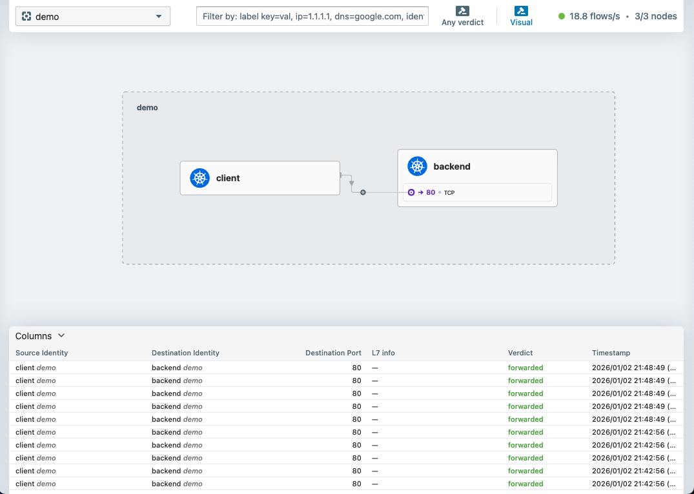

# Chapter 1: Basic Operations

Learn the basic operations of Cilium through hands-on exercises.

**Official Documentation**: [Hubble](https://docs.cilium.io/en/stable/observability/hubble/)

## 1. Deploy Demo Application

Deploy a simple client-backend application:

```bash
kubectl apply -f manifests/demo-app/deployment.yaml
```

Verify pods are running:

```bash
kubectl get pods -n demo
```

Expected output:

```text
 ❯ kubectl get pods -n demo
NAME                       READY   STATUS    RESTARTS   AGE
backend-657df4f9d8-sh6lt   1/1     Running   0          6m17s
```

## 2. Verify Connectivity

### Pod to Service

```bash
kubectl exec -n demo client -- curl -s backend/get
```

Expected output:

```json
 ❯ kubectl exec -n demo client -- curl -s backend/get
{
  "args": {},
  "headers": {
    "Accept": "*/*",
    "Host": "backend",
    "User-Agent": "curl/8.17.0"
  },
  "origin": "10.0.2.196",
  "url": "http://backend/get"
}
```

### Test Different HTTP Methods

```json
# POST request
 ❯ kubectl exec -n demo client -- curl -s backend/post -X POST -d "key=value"
{
  "args": {},
  "data": "",
  "files": {},
  "form": {
    "key": "value"
  },
  "headers": {
    "Accept": "*/*",
    "Content-Length": "9",
    "Content-Type": "application/x-www-form-urlencoded",
    "Host": "backend",
    "User-Agent": "curl/8.17.0"
  },
  "json": null,
  "origin": "10.0.2.196",
  "url": "http://backend/post"
}

# Headers
 ❯ kubectl exec -n demo client -- curl -s backend/headers
{
  "headers": {
    "Accept": "*/*",
    "Host": "backend",
    "User-Agent": "curl/8.17.0"
  }
}
```

## 3. Observe with Hubble

### Hubble CLI

Watch network flows in real-time:

```bash
 ❯ hubble observe -n demo
Jan  2 12:50:52.365: demo/client:59076 (ID:22917) -> kube-system/coredns-7d764666f9-4t6zl:53 (ID:7909) to-endpoint FORWARDED (UDP)
Jan  2 12:50:52.365: demo/client:59076 (ID:22917) <> kube-system/coredns-7d764666f9-4t6zl (ID:7909) pre-xlate-rev TRACED (UDP)
Jan  2 12:50:52.365: demo/client:59076 (ID:22917) <> kube-system/coredns-7d764666f9-4t6zl (ID:7909) pre-xlate-rev TRACED (UDP)
Jan  2 12:50:52.366: demo/client:59076 (ID:22917) <- kube-system/coredns-7d764666f9-4t6zl:53 (ID:7909) to-overlay FORWARDED (UDP)
Jan  2 12:51:20.053: demo/client:58495 (ID:22917) -> kube-system/coredns-7d764666f9-jbn7k:53 (ID:7909) to-overlay FORWARDED (UDP)
Jan  2 12:51:20.053: demo/client:58495 (ID:22917) -> kube-system/coredns-7d764666f9-jbn7k:53 (ID:7909) to-endpoint FORWARDED (UDP)
Jan  2 12:51:20.053: demo/client (ID:22917) <> kube-system/kube-dns:53 (world) pre-xlate-fwd TRACED (UDP)                  Jan  2 12:51:20.053: demo/client (ID:22917) <> kube-system/coredns-7d764666f9-jbn7k:53 (ID:7909) post-xlate-fwd TRANSLATED (UDP)                                    Jan  2 12:51:20.053: demo/client:58495 (ID:22917) <> kube-system/coredns-7d764666f9-jbn7k (ID:7909) pre-xlate-rev TRACED (UDP)                                      Jan  2 12:51:20.053: demo/client:58495 (ID:22917) <> kube-system/coredns-7d764666f9-jbn7k (ID:7909) pre-xlate-rev TRACED (UDP)                                      Jan  2 12:51:20.053: demo/client:58495 (ID:22917) <- kube-system/coredns-7d764666f9-jbn7k:53 (ID:7909) to-overlay FORWARDED (UDP)                                   Jan  2 12:51:20.053: demo/client:58495 (ID:22917) <- kube-system/coredns-7d764666f9-jbn7k:53 (ID:7909) to-endpoint FORWARDED (UDP)                                  Jan  2 12:51:20.053: kube-system/coredns-7d764666f9-jbn7k:53 (ID:7909) <> demo/client (ID:22917) pre-xlate-rev TRACED (UDP)Jan  2 12:51:20.053: kube-system/kube-dns:53 (world) <> demo/client (ID:22917) post-xlate-rev TRANSLATED (UDP)
Jan  2 12:51:20.053: kube-system/coredns-7d764666f9-jbn7k:53 (ID:7909) <> demo/client (ID:22917) pre-xlate-rev TRACED (UDP)
Jan  2 12:51:20.053: kube-system/kube-dns:53 (world) <> demo/client (ID:22917) post-xlate-rev TRANSLATED (UDP)
Jan  2 12:51:20.053: demo/client (ID:22917) <> demo/backend:80 (world) pre-xlate-fwd TRACED (TCP)
Jan  2 12:51:20.053: demo/client (ID:22917) <> demo/backend-657df4f9d8-sh6lt:80 (ID:40767) post-xlate-fwd TRANSLATED (TCP)
Jan  2 12:51:20.053: demo/client:46722 (ID:22917) -> demo/backend-657df4f9d8-sh6lt:80 (ID:40767) to-endpoint FORWARDED (TCP Flags: SYN)
Jan  2 12:51:20.053: demo/client:46722 (ID:22917) <- demo/backend-657df4f9d8-sh6lt:80 (ID:40767) to-endpoint FORWARDED (TCP Flags: SYN, ACK)
Jan  2 12:51:20.053: demo/client:46722 (ID:22917) -> demo/backend-657df4f9d8-sh6lt:80 (ID:40767) to-endpoint FORWARDED (TCP Flags: ACK)
Jan  2 12:51:20.053: demo/client:46722 (ID:22917) -> demo/backend-657df4f9d8-sh6lt:80 (ID:40767) to-endpoint FORWARDED (TCP Flags: ACK, PSH)
Jan  2 12:51:20.053: demo/client:46722 (ID:22917) <> demo/backend-657df4f9d8-sh6lt (ID:40767) pre-xlate-rev TRACED (TCP)
Jan  2 12:51:20.054: demo/client:46722 (ID:22917) <> demo/backend-657df4f9d8-sh6lt (ID:40767) pre-xlate-rev TRACED (TCP)
Jan  2 12:51:20.054: demo/client:46722 (ID:22917) <- demo/backend-657df4f9d8-sh6lt:80 (ID:40767) to-endpoint FORWARDED (TCP Flags: ACK, PSH)
Jan  2 12:51:20.055: demo/client:46722 (ID:22917) -> demo/backend-657df4f9d8-sh6lt:80 (ID:40767) to-endpoint FORWARDED (TCP Flags: ACK, FIN)
Jan  2 12:51:20.055: demo/client:46722 (ID:22917) <- demo/backend-657df4f9d8-sh6lt:80 (ID:40767) to-endpoint FORWARDED (TCP Flags: ACK, FIN)
Jan  2 12:51:20.055: demo/client:46722 (ID:22917) -> demo/backend-657df4f9d8-sh6lt:80 (ID:40767) to-endpoint FORWARDED (TCP Flags: ACK)
EVENTS LOST: HUBBLE_RING_BUFFER CPU(0) 1
```

Filter by pod:

```bash
❯ hubble observe -n demo --pod client
Jan  2 12:50:52.365: demo/client:59076 (ID:22917) -> kube-system/coredns-7d764666f9-4t6zl:53 (ID:7909) to-endpoint FORWARDED (UDP)
Jan  2 12:50:52.365: demo/client:59076 (ID:22917) <> kube-system/coredns-7d764666f9-4t6zl (ID:7909) pre-xlate-rev TRACED (UDP)
Jan  2 12:50:52.365: demo/client:59076 (ID:22917) <> kube-system/coredns-7d764666f9-4t6zl (ID:7909) pre-xlate-rev TRACED (UDP)
Jan  2 12:50:52.366: demo/client:59076 (ID:22917) <- kube-system/coredns-7d764666f9-4t6zl:53 (ID:7909) to-overlay FORWARDED (UDP)
Jan  2 12:51:20.053: demo/client:58495 (ID:22917) -> kube-system/coredns-7d764666f9-jbn7k:53 (ID:7909) to-overlay FORWARDED (UDP)
Jan  2 12:51:20.053: demo/client:58495 (ID:22917) -> kube-system/coredns-7d764666f9-jbn7k:53 (ID:7909) to-endpoint FORWARDED (UDP)
Jan  2 12:51:20.053: demo/client (ID:22917) <> kube-system/kube-dns:53 (world) pre-xlate-fwd TRACED (UDP)                  Jan  2 12:51:20.053: demo/client (ID:22917) <> kube-system/coredns-7d764666f9-jbn7k:53 (ID:7909) post-xlate-fwd TRANSLATED (UDP)
Jan  2 12:51:20.053: demo/client:58495 (ID:22917) <> kube-system/coredns-7d764666f9-jbn7k (ID:7909) pre-xlate-rev TRACED (UDP)                                      Jan  2 12:51:20.053: demo/client:58495 (ID:22917) <> kube-system/coredns-7d764666f9-jbn7k (ID:7909) pre-xlate-rev TRACED (UDP)                                      Jan  2 12:51:20.053: demo/client:58495 (ID:22917) <- kube-system/coredns-7d764666f9-jbn7k:53 (ID:7909) to-overlay FORWARDED (UDP)                                   Jan  2 12:51:20.053: demo/client:58495 (ID:22917) <- kube-system/coredns-7d764666f9-jbn7k:53 (ID:7909) to-endpoint FORWARDED (UDP)                                  Jan  2 12:51:20.053: kube-system/coredns-7d764666f9-jbn7k:53 (ID:7909) <> demo/client (ID:22917) pre-xlate-rev TRACED (UDP)Jan  2 12:51:20.053: kube-system/kube-dns:53 (world) <> demo/client (ID:22917) post-xlate-rev TRANSLATED (UDP)             Jan  2 12:51:20.053: kube-system/coredns-7d764666f9-jbn7k:53 (ID:7909) <> demo/client (ID:22917) pre-xlate-rev TRACED (UDP)Jan  2 12:51:20.053: kube-system/kube-dns:53 (world) <> demo/client (ID:22917) post-xlate-rev TRANSLATED (UDP)             Jan  2 12:51:20.053: demo/client (ID:22917) <> demo/backend:80 (world) pre-xlate-fwd TRACED (TCP)                          Jan  2 12:51:20.053: demo/client (ID:22917) <> demo/backend-657df4f9d8-sh6lt:80 (ID:40767) post-xlate-fwd TRANSLATED (TCP) Jan  2 12:51:20.053: demo/client:46722 (ID:22917) -> demo/backend-657df4f9d8-sh6lt:80 (ID:40767) to-endpoint FORWARDED (TCP Flags: SYN)                             Jan  2 12:51:20.053: demo/client:46722 (ID:22917) <- demo/backend-657df4f9d8-sh6lt:80 (ID:40767) to-endpoint FORWARDED (TCP Flags: SYN, ACK)                        Jan  2 12:51:20.053: demo/client:46722 (ID:22917) -> demo/backend-657df4f9d8-sh6lt:80 (ID:40767) to-endpoint FORWARDED (TCP Flags: ACK)                             Jan  2 12:51:20.053: demo/client:46722 (ID:22917) -> demo/backend-657df4f9d8-sh6lt:80 (ID:40767) to-endpoint FORWARDED (TCP Flags: ACK, PSH)                        Jan  2 12:51:20.053: demo/client:46722 (ID:22917) <> demo/backend-657df4f9d8-sh6lt (ID:40767) pre-xlate-rev TRACED (TCP)   Jan  2 12:51:20.054: demo/client:46722 (ID:22917) <> demo/backend-657df4f9d8-sh6lt (ID:40767) pre-xlate-rev TRACED (TCP)   Jan  2 12:51:20.054: demo/client:46722 (ID:22917) <- demo/backend-657df4f9d8-sh6lt:80 (ID:40767) to-endpoint FORWARDED (TCP Flags: ACK, PSH)                        Jan  2 12:51:20.055: demo/client:46722 (ID:22917) -> demo/backend-657df4f9d8-sh6lt:80 (ID:40767) to-endpoint FORWARDED (TCP Flags: ACK, FIN)                        Jan  2 12:51:20.055: demo/client:46722 (ID:22917) <- demo/backend-657df4f9d8-sh6lt:80 (ID:40767) to-endpoint FORWARDED (TCP Flags: ACK, FIN)                        Jan  2 12:51:20.055: demo/client:46722 (ID:22917) -> demo/backend-657df4f9d8-sh6lt:80 (ID:40767) to-endpoint FORWARDED (TCP Flags: ACK)                             EVENTS LOST: HUBBLE_RING_BUFFER CPU(0) 1
EVENTS LOST: HUBBLE_RING_BUFFER CPU(0) 1
```

Filter by verdict:

```bash
# Only forwarded (allowed) flows
> hubble observe -n demo --verdict FORWARDED

Jan  2 12:50:52.365: demo/client:59076 (ID:22917) -> kube-system/coredns-7d764666f9-4t6zl:53 (ID:7909) to-overlay FORWARDED (UDP)
Jan  2 12:50:52.365: demo/client:59076 (ID:22917) -> kube-system/coredns-7d764666f9-4t6zl:53 (ID:7909) to-endpoint FORWARDED (UDP)
Jan  2 12:50:52.366: demo/client:59076 (ID:22917) <- kube-system/coredns-7d764666f9-4t6zl:53 (ID:7909) to-overlay FORWARDED (UDP)
Jan  2 12:50:52.366: demo/client:59076 (ID:22917) <- kube-system/coredns-7d764666f9-4t6zl:53 (ID:7909) to-endpoint FORWARDED (UDP)
Jan  2 12:50:52.366: demo/client:47322 (ID:22917) -> demo/backend-657df4f9d8-sh6lt:80 (ID:40767) to-endpoint FORWARDED (TCP Flags: SYN)
Jan  2 12:50:52.366: demo/client:47322 (ID:22917) <- demo/backend-657df4f9d8-sh6lt:80 (ID:40767) to-endpoint FORWARDED (TCP Flags: SYN, ACK)
Jan  2 12:50:52.366: demo/client:47322 (ID:22917) -> demo/backend-657df4f9d8-sh6lt:80 (ID:40767) to-endpoint FORWARDED (TCP Flags: ACK)
Jan  2 12:50:52.366: demo/client:47322 (ID:22917) -> demo/backend-657df4f9d8-sh6lt:80 (ID:40767) to-endpoint FORWARDED (TCP Flags: ACK, PSH)
Jan  2 12:50:52.367: demo/client:47322 (ID:22917) <- demo/backend-657df4f9d8-sh6lt:80 (ID:40767) to-endpoint FORWARDED (TCP Flags: ACK, PSH)
Jan  2 12:50:52.367: demo/client:47322 (ID:22917) -> demo/backend-657df4f9d8-sh6lt:80 (ID:40767) to-endpoint FORWARDED (TCP Flags: ACK, FIN)
Jan  2 12:50:52.367: demo/client:47322 (ID:22917) <- demo/backend-657df4f9d8-sh6lt:80 (ID:40767) to-endpoint FORWARDED (TCP Flags: ACK, FIN)
Jan  2 12:50:52.367: demo/client:47322 (ID:22917) -> demo/backend-657df4f9d8-sh6lt:80 (ID:40767) to-endpoint FORWARDED (TCP Flags: ACK)
Jan  2 12:51:20.053: demo/client:58495 (ID:22917) -> kube-system/coredns-7d764666f9-jbn7k:53 (ID:7909) to-overlay FORWARDED (UDP)
Jan  2 12:51:20.053: demo/client:58495 (ID:22917) -> kube-system/coredns-7d764666f9-jbn7k:53 (ID:7909) to-endpoint FORWARDED (UDP)
Jan  2 12:51:20.053: demo/client:58495 (ID:22917) <- kube-system/coredns-7d764666f9-jbn7k:53 (ID:7909) to-overlay FORWARDED (UDP)
Jan  2 12:51:20.053: demo/client:58495 (ID:22917) <- kube-system/coredns-7d764666f9-jbn7k:53 (ID:7909) to-endpoint FORWARDED (UDP)
Jan  2 12:51:20.053: demo/client:46722 (ID:22917) -> demo/backend-657df4f9d8-sh6lt:80 (ID:40767) to-endpoint FORWARDED (TCP Flags: SYN)
Jan  2 12:51:20.053: demo/client:46722 (ID:22917) <- demo/backend-657df4f9d8-sh6lt:80 (ID:40767) to-endpoint FORWARDED (TCP Flags: SYN, ACK)
Jan  2 12:51:20.053: demo/client:46722 (ID:22917) -> demo/backend-657df4f9d8-sh6lt:80 (ID:40767) to-endpoint FORWARDED (TCP Flags: ACK)
Jan  2 12:51:20.053: demo/client:46722 (ID:22917) -> demo/backend-657df4f9d8-sh6lt:80 (ID:40767) to-endpoint FORWARDED (TCP Flags: ACK, PSH)
Jan  2 12:51:20.054: demo/client:46722 (ID:22917) <- demo/backend-657df4f9d8-sh6lt:80 (ID:40767) to-endpoint FORWARDED (TCP Flags: ACK, PSH)
Jan  2 12:51:20.055: demo/client:46722 (ID:22917) -> demo/backend-657df4f9d8-sh6lt:80 (ID:40767) to-endpoint FORWARDED (TCP Flags: ACK, FIN)
Jan  2 12:51:20.055: demo/client:46722 (ID:22917) <- demo/backend-657df4f9d8-sh6lt:80 (ID:40767) to-endpoint FORWARDED (TCP Flags: ACK, FIN)
Jan  2 12:51:20.055: demo/client:46722 (ID:22917) -> demo/backend-657df4f9d8-sh6lt:80 (ID:40767) to-endpoint FORWARDED (TCP Flags: ACK)
EVENTS LOST: HUBBLE_RING_BUFFER CPU(0) 1


# Only dropped flows
> hubble observe -n demo --verdict DROPPED

EVENTS LOST: HUBBLE_RING_BUFFER CPU(0) 1
EVENTS LOST: HUBBLE_RING_BUFFER CPU(0) 1
EVENTS LOST: HUBBLE_RING_BUFFER CPU(0) 1

```

### Hubble UI

Open Hubble UI in browser:

```bash
make hubble-ui
```

1. Select `demo` namespace from the dropdown
1. Generate traffic: `kubectl exec -n demo client -- curl -s backend/get`
1. Observe the flow between `client` and `backend`



## 4. Cilium Status Commands

### Cluster Status

```bash
 ❯ cilium status
    /¯¯\
 /¯¯\__/¯¯\    Cilium:             OK
 \__/¯¯\__/    Operator:           OK
 /¯¯\__/¯¯\    Envoy DaemonSet:    OK
 \__/¯¯\__/    Hubble Relay:       OK
    \__/       ClusterMesh:        disabled

DaemonSet              cilium             Desired: 3, Ready: 3/3, Available: 3/3
DaemonSet              cilium-envoy       Desired: 3, Ready: 3/3, Available: 3/3
Deployment             cilium-operator    Desired: 2, Ready: 2/2, Available: 2/2
Deployment             hubble-relay       Desired: 1, Ready: 1/1, Available: 1/1
Deployment             hubble-ui          Desired: 1, Ready: 1/1, Available: 1/1
Containers:            cilium             Running: 3
                       cilium-envoy       Running: 3
                       cilium-operator    Running: 2
                       hubble-relay       Running: 1                                                     hubble-ui          Running: 1                              Cluster Pods:          7/7 managed by Cilium                                      Helm chart version:    1.16.5            Image versions         cilium             quay.io/cilium/cilium:v1.16.5@sha256:758ca0793f5995bb938a2fa219dcce63dc0b3fa7fc4ce5cc851125281fb7361d: 3                                         cilium-envoy       quay.io/cilium/cilium-envoy:v1.30.8-1733837904-eaae5aca0fb988583e5617170a65ac5aa51c0aa8@sha256:709c08ade3d17d52da4ca2af33f431360ec26268d288d9a6cd1d98acc9a1dced: 3                        cilium-operator    quay.io/cilium/operator-generic:v1.16.5@sha256:f7884848483bbcd7b1e0ccfd34ba4546f258b460cb4b7e2f06a1bcc96ef88039: 2                               hubble-relay       quay.io/cilium/hubble-relay:v1.16.5@sha256:6cfae1d1afa566ba941f03d4d7e141feddd05260e5cd0a1509aba1890a45ef00: 1                                   hubble-ui          quay.io/cilium/hubble-ui-backend:v0.13.1@sha256:0e0eed917653441fded4e7cdb096b7be6a3bddded5a2dd10812a27b1fc6ed95b: 1                              hubble-ui          quay.io/cilium/hubble-ui:v0.13.1@sha256:e2e9313eb7caf64b0061d9da0efbdad59c6c461f6ca1752768942bfeda0796c6: 1
```

Key things to check:

- All components show `OK`
- DaemonSet pods are `Ready`
- Cluster Pods are `managed by Cilium`

### Endpoint List

View all endpoints (pods) managed by Cilium:

```bash
 ❯ kubectl -n kube-system exec ds/cilium -c cilium-agent -- cilium-dbg endpoint list
ENDPOINT   POLICY (ingress)   POLICY (egress)   IDENTITY   LABELS (source:key[=value])                                                         IPv6   IPv4         STATUS
           ENFORCEMENT        ENFORCEMENT
200        Disabled           Disabled          4          reserved:health                                                                            10.0.0.35    ready
508        Disabled           Disabled          10098      k8s:app=local-path-provisioner                                                             10.0.0.117   ready
                                                           k8s:io.cilium.k8s.namespace.labels.kubernetes.io/metadata.name=local-path-storage
                                                           k8s:io.cilium.k8s.policy.cluster=default
                                                           k8s:io.cilium.k8s.policy.serviceaccount=local-path-provisioner-service-account
                                                           k8s:io.kubernetes.pod.namespace=local-path-storage
758        Disabled           Disabled          7909       k8s:io.cilium.k8s.namespace.labels.kubernetes.io/metadata.name=kube-system                 10.0.0.75    ready
                                                           k8s:io.cilium.k8s.policy.cluster=default
                                                           k8s:io.cilium.k8s.policy.serviceaccount=coredns
                                                           k8s:io.kubernetes.pod.namespace=kube-system
                                                           k8s:k8s-app=kube-dns
1067       Disabled           Disabled          1          k8s:ingress-ready=true                                                                                  ready
                                                           k8s:node-role.kubernetes.io/control-plane
                                                           k8s:node.kubernetes.io/exclude-from-external-load-balancers
                                                           reserved:host
1559       Disabled           Disabled          7909       k8s:io.cilium.k8s.namespace.labels.kubernetes.io/metadata.name=kube-system                 10.0.0.174   ready
                                                           k8s:io.cilium.k8s.policy.cluster=default
                                                           k8s:io.cilium.k8s.policy.serviceaccount=coredns
                                                           k8s:io.kubernetes.pod.namespace=kube-system
                                                           k8s:k8s-app=kube-dns
```

### Connectivity Test

Run built-in connectivity test:

```bash
cilium connectivity test
```

> Note: This test deploys temporary pods and may take a few minutes.

## Summary

In this chapter, you learned:

- How to verify Pod-to-Service connectivity
- How to observe network flows with Hubble CLI and UI
- Basic Cilium status commands for troubleshooting

Next: [Chapter 2 - Network Policy](./chapter2-network-policy.md)
